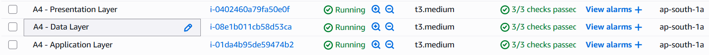
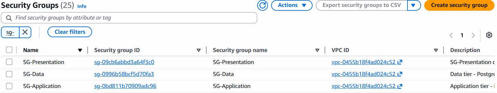
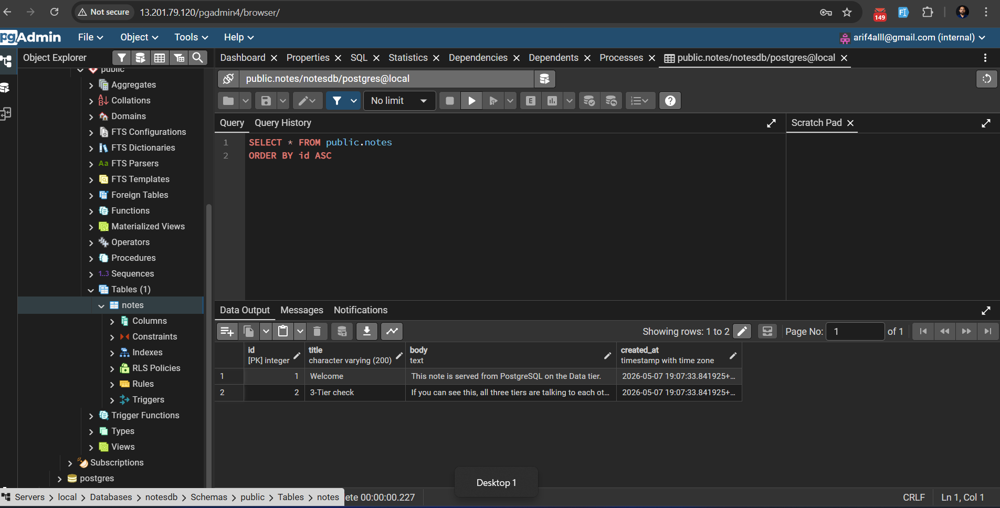
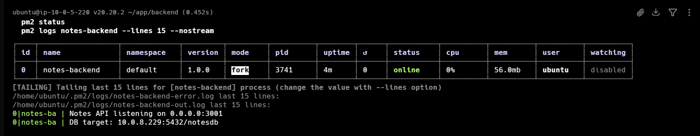
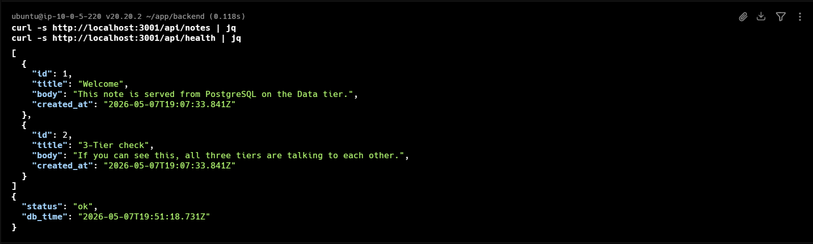
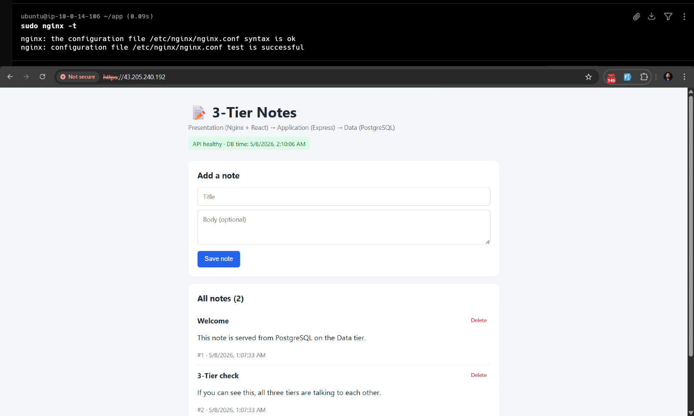
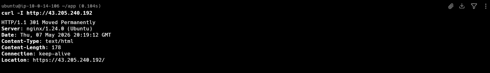
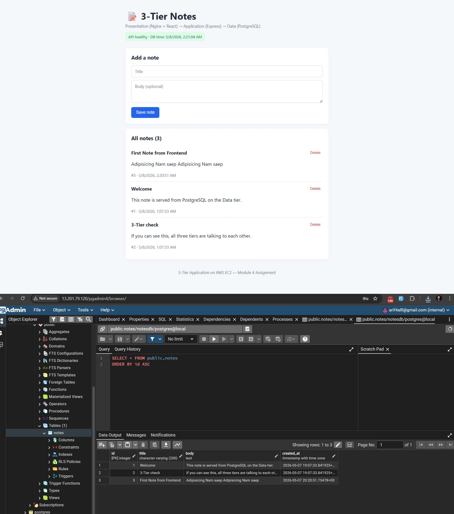

# 3-Tier Application on AWS EC2 — Module 4 Assignment

A simple **Notes** web app deployed across three EC2 instances, with each tier running on its own instance and communicating only through the next tier.

## Architecture

```
                    ┌────────────────────────────┐
   User browser ──► │ Presentation Tier (EC2 #1) │
                    │   Nginx :443 (HTTPS)       │
                    │   :80 → 301 redirect       │
                    │   serves built React app   │
                    │   reverse-proxies /api/*   │
                    └──────────────┬─────────────┘
                                   │  HTTP /api/*
                                   ▼
                    ┌────────────────────────────┐
                    │ Application Tier (EC2 #2)  │
                    │   Node.js + Express :3001  │
                    │   REST API for notes       │
                    └──────────────┬─────────────┘
                                   │  TCP 5432
                                   ▼
                    ┌────────────────────────────┐
                    │ Data Tier (EC2 #3)         │
                    │   PostgreSQL :5432         │
                    │   pgAdmin4-web :80/pgadmin4│
                    └────────────────────────────┘
```

| Tier | EC2 | Software | Public access |
|---|---|---|---|
| Presentation | #1 | Nginx, built React (Vite) bundle, self-signed TLS | Port 443 (HTTPS) + 80 (redirects to 443) — open to the internet |
| Application  | #2 | Node.js 20, Express, `pg` | Port 3001 (open **only** to EC2 #1) |
| Data         | #3 | PostgreSQL 14+, pgAdmin4-web | Port 5432 (open **only** to EC2 #2); Port 80 (pgAdmin) open to your IP |

## Repository layout

```
.
├── README.md
├── backend/                  # Application tier (Node.js + Express)
│   ├── package.json
│   ├── server.js
│   ├── .env.example
│   └── .gitignore
├── frontend/                 # Presentation tier source (React + Vite)
│   ├── package.json
│   ├── vite.config.js
│   ├── index.html
│   ├── src/
│   │   ├── main.jsx
│   │   ├── App.jsx
│   │   └── styles.css
│   └── .gitignore
├── database/                 # Data tier
│   ├── init.sql              # notes table + sample rows
│   ├── setup-postgres.sh     # native install of PostgreSQL
│   └── setup-pgadmin.sh      # native install of pgAdmin4 web mode
├── deployment/
│   ├── nginx-frontend.conf   # Nginx site config for EC2 #1 (HTTPS + redirect)
│   └── generate-ssl-cert.sh  # creates the self-signed TLS cert on EC2 #1
└── docs/
    ├── security-groups.md    # detailed SG cheat-sheet + verification commands
    └── screenshots-checklist.md  # what to capture for each of the 9 screenshots
```

---

## Prerequisites

- 3 running EC2 instances (Ubuntu 22.04 or 24.04 LTS recommended)
- All 3 instances in the **same VPC** (so they can reach each other on private IPs)
- A key pair `.pem` file with permissions `chmod 400 your-key.pem`
- The public IPs of all 3 instances and the private IP of EC2 #2 and EC2 #3

> **Deployment IPs for this submission:**
>
> | Instance              | Public IP        | Private IP   |
> |-----------------------|------------------|--------------|
> | EC2 #1 (Presentation) | `43.205.240.192` | `10.0.14.106`|
> | EC2 #2 (Application)  | `43.205.138.22`  | `10.0.5.220` |
> | EC2 #3 (Data)         | `13.201.79.120`  | `10.0.8.229` |
>
> Region: `ap-south-1` (Mumbai). All three are in VPC `vpc-0455b18f4ad024c52`.

## Security Group rules

Create three security groups (one per tier) and apply them as below. Each tier should only accept traffic from the tier directly above it.

**SG-Presentation (attached to EC2 #1)**

| Type  | Port | Source        | Purpose                              |
|-------|------|---------------|--------------------------------------|
| SSH   | 22   | Your IP       | Admin                                |
| HTTPS | 443  | `0.0.0.0/0`   | User traffic (TLS)                   |
| HTTP  | 80   | `0.0.0.0/0`   | Redirected by Nginx to 443           |

**SG-Application (attached to EC2 #2)**

| Type | Port | Source | Purpose |
|---|---|---|---|
| SSH | 22 | Your IP | Admin |
| Custom TCP | 3001 | `SG-Presentation` | API traffic from Nginx |

**SG-Data (attached to EC2 #3)**

| Type | Port | Source | Purpose |
|---|---|---|---|
| SSH | 22 | Your IP | Admin |
| PostgreSQL | 5432 | `SG-Application` | DB traffic from API |
| HTTP | 80 | Your IP | pgAdmin web UI |

---

## Setup

The order matters: **Data → Application → Presentation**. The database has to exist before the API tries to connect.

### Step 0 — Clone the repository on each EC2

On each of the three EC2 instances:

```bash
sudo apt-get update -y
sudo apt-get install -y git
git clone https://github.com/ruhulOTZ/3-tier-application-on-AWS-EC2 ~/app
cd ~/app
```

---

### Step 1 — Data Tier (EC2 #3)

**1.1 — Edit values, install PostgreSQL, create DB and user**

```bash
cd ~/app/database
# Open setup-postgres.sh and edit:
#   DB_PASSWORD       -> a strong password
#   APP_TIER_CIDR     -> your VPC CIDR (e.g. 172.31.0.0/16) or App-tier private IP /32
nano setup-postgres.sh

chmod +x setup-postgres.sh
sudo ./setup-postgres.sh
```

When this finishes you should be able to run:

```bash
sudo -u postgres psql -d notesdb -c "SELECT * FROM notes;"
```

…and see the two sample rows.

**1.2 — Install pgAdmin4 in web mode**

```bash
chmod +x setup-pgadmin.sh
sudo ./setup-pgadmin.sh
```

The script will prompt you for a pgAdmin admin email and password. Pick anything you'll remember — this is just for logging into the pgAdmin web UI.

After it finishes, set a password for the `postgres` database role so pgAdmin can connect to it via TCP/IP:

```bash
sudo -u postgres psql -c "ALTER USER postgres WITH PASSWORD 'pick_a_strong_password';"
```

**1.3 — Verify pgAdmin web UI**

Open in your browser:

```
http://13.201.79.120/pgadmin4
```

Log in with the admin email/password you set. Then register a server:

- General → Name: `local`
- Connection → Host: `127.0.0.1`, Port: `5432`, Maintenance DB: `postgres`, Username: `postgres`, Password: the one you just set above

You should now see `notesdb` in the tree, and the `notes` table inside it.

---

### Step 2 — Application Tier (EC2 #2)

**2.1 — Install Node.js 20**

```bash
curl -fsSL https://deb.nodesource.com/setup_20.x | sudo -E bash -
sudo apt-get install -y nodejs
node --version    # v20.x
```

**2.2 — Install backend dependencies**

```bash
cd ~/app/backend
npm install
```

**2.3 — Configure environment**

```bash
cp .env.example .env
nano .env
```

Set:

```
PORT=3001
DB_HOST=10.0.8.229                   # private IP of EC2 #3 (Data tier)
DB_PORT=5432
DB_NAME=notesdb
DB_USER=notesuser
DB_PASSWORD=<the password you set in setup-postgres.sh>
```

**2.4 — Smoke test**

```bash
node server.js
# In another terminal on the same instance:
curl http://localhost:3001/api/health
# Expect: {"status":"ok","db_time":"..."}
```

Press `Ctrl+C` to stop.

**2.5 — Run with PM2 (so it survives reboots)**

PM2 is a process manager for Node.js. It keeps the API alive after crashes, restarts it on boot, and provides handy log/monitoring commands.

```bash
# Install PM2 globally
sudo npm install -g pm2

# Start the API from the backend directory (so .env is found)
cd ~/app/backend
pm2 start server.js --name notes-backend

# Confirm it's online
pm2 status
pm2 logs notes-backend --lines 30
```

You should see `notes-backend` in `online` state, and the logs should print:
```
Notes API listening on 0.0.0.0:3001
DB target: 10.0.8.229:5432/notesdb
```

**Make PM2 start on boot:**

```bash
# Save current process list as the boot manifest
pm2 save

# Generate the systemd unit that brings PM2 up on boot
pm2 startup systemd -u ubuntu --hp /home/ubuntu
```

The `pm2 startup` command prints a `sudo env PATH=...` line — **copy and run that exact command** to actually install the unit.

**Verify reboot survival (optional but proves it works):**

```bash
sudo reboot
# wait ~30s, SSH back in
pm2 status     # notes-backend should be 'online' again automatically
```

**Useful PM2 commands while debugging:**

```bash
pm2 logs notes-backend          # tail live logs
pm2 logs notes-backend --err    # only stderr
pm2 restart notes-backend       # after editing code
pm2 monit                       # interactive CPU/mem monitor
```

---

### Step 3 — Presentation Tier (EC2 #1)

**3.1 — Install Node.js + Nginx**

```bash
curl -fsSL https://deb.nodesource.com/setup_20.x | sudo -E bash -
sudo apt-get install -y nodejs nginx
```

**3.2 — Build the React app**

```bash
cd ~/app/frontend
npm install
npm run build
# This produces a 'dist/' directory containing static HTML/CSS/JS
```

**3.3 — Publish the build to Nginx's web root**

```bash
sudo mkdir -p /var/www/notes-frontend
sudo rm -rf /var/www/notes-frontend/*
sudo cp -r dist/* /var/www/notes-frontend/
sudo chown -R www-data:www-data /var/www/notes-frontend
```

**3.4 — Generate the self-signed TLS certificate**

```bash
cd ~/app/deployment
chmod +x generate-ssl-cert.sh
sudo ./generate-ssl-cert.sh
# Produces:
#   /etc/ssl/notes/notes.crt
#   /etc/ssl/notes/notes.key
# The cert is bound to this EC2's public IP and valid for 365 days.
```

If for any reason the script can't auto-detect the public IP (rare), pass it explicitly:

```bash
sudo PUBLIC_IP_OVERRIDE=<EC2#1_PUBLIC_IP> ./generate-ssl-cert.sh
```

**3.5 — Configure Nginx**

```bash
sudo cp ~/app/deployment/nginx-frontend.conf /etc/nginx/sites-available/notes-frontend

sudo ln -sf /etc/nginx/sites-available/notes-frontend /etc/nginx/sites-enabled/notes-frontend
sudo rm -f /etc/nginx/sites-enabled/default
sudo nginx -t                     # should report "syntax is ok / test is successful"
sudo systemctl reload nginx
```

> The upstream IP (`10.0.5.220` — private IP of EC2 #2) is already baked into `nginx-frontend.conf`. If you ever redeploy with different IPs, edit the `upstream notes_app { server <ip>:3001; }` block before copying.

---

## Application access result

Open in your browser:

```
https://43.205.240.192/
```

> **First-visit warning:** Because the cert is self-signed, your browser will show a "Your connection is not private" / "Not secure" warning. Click **Advanced → Proceed anyway** (Chrome) or **Advanced → Accept the Risk and Continue** (Firefox). This warning is expected and does not mean anything is broken — it just means the cert wasn't issued by a public CA. The connection itself is encrypted with TLS.

You should see the **3-Tier Notes** UI with:

- A green health badge ("API healthy · DB time: …") confirming Presentation → Application → Data is fully wired up
- Two sample notes from the data tier
- A form to add a new note — submit it and it appears in the list, then verify in pgAdmin with `SELECT * FROM notes;`

Plain `http://...` requests are auto-redirected to HTTPS (HTTP 301) by Nginx. Test it:

```bash
curl -I http://43.205.240.192/
# HTTP/1.1 301 Moved Permanently
# Location: https://43.205.240.192/
```

API can also be reached directly via Nginx (use `-k` so curl accepts the self-signed cert):

```
https://43.205.240.192/api/health
https://43.205.240.192/api/notes
```

```bash
curl -k https://43.205.240.192/api/health
```

pgAdmin is reachable at (still HTTP — internal admin only, restricted to your IP):

```
http://13.201.79.120/pgadmin4
```

---

## Screenshots (proof of work)

All screenshots are stored in [`screenshots/`](screenshots/).

### 1. EC2 console — 3 running instances



### 2. Security groups — separation between tiers



### 3. Data tier — `psql` output of `SELECT * FROM notes;`


### 4. Data tier — pgAdmin web UI showing the `notes` table



### 5. Application tier — PM2 process online



### 6. Application tier — API health check



### 7. Presentation tier — Nginx + React UI over HTTPS



### 7b. HTTP → HTTPS redirect



### 8. End-to-end — note added in UI, visible in pgAdmin



---

## Submission checklist

- [x] All three EC2 instances running and reachable
- [x] Security groups configured per the tables above
- [x] `setup-postgres.sh` ran cleanly on EC2 #3
- [x] pgAdmin web UI accessible at `http://13.201.79.120/pgadmin4`
- [x] `notes-backend` is `online` under PM2 on EC2 #2 (`pm2 status`)
- [x] React build deployed to `/var/www/notes-frontend` on EC2 #1
- [x] Self-signed TLS cert generated at `/etc/ssl/notes/`
- [x] `nginx -t` succeeds and Nginx reloaded
- [x] App opens at `https://43.205.240.192/` with green health badge (after accepting the self-signed-cert warning)
- [x] `http://43.205.240.192/` returns a 301 redirect to `https://`
- [x] All 9 screenshots captured under `screenshots/`
- [x] Repo pushed to git with this README at the root
